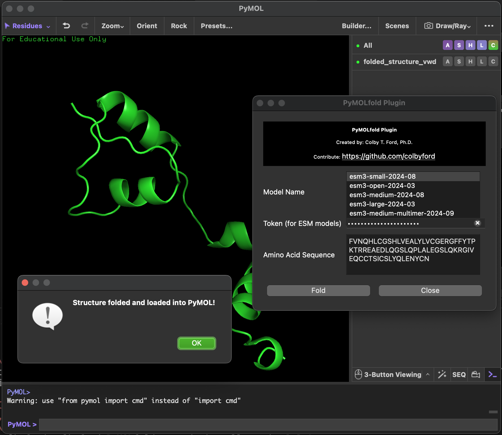

# PyMOLfold
Plugin for folding sequences directly in PyMOL using various models (ESM3, Boltz-1, and Chai-1).

<h3 align="right">Colby T. Ford, Ph.D.</h3>



## Plugin Installation

### From Local Download
1. Download the *pymolfold.zip* file from this repository.
    - Latest package: [pymolfold.zip](pymolfold.zip)
    - Stable release: [pymolfold_v0.2.0.zip](https://github.com/colbyford/PyMOLfold/releases/download/v0.1.0/pymolfold_v0.2.0.zip)
2. Open PyMOL and in the menu bar, go to *Plugin* > *Plugin Manager*.
3. On the *Install New Plugin* tab, click the *Choose file...* button under "Install from local file".
4. Locate the .zip file and open it.

### From the Web

1. Open PyMOL and in the menu bar, go to *Plugin* > *Plugin Manager*.

2. On the *Install New Plugin* tab, under the *Install from PyuMOLWiki or any URL* section,  paste in the URL of the release .zip file from GitHub.
    - `https://github.com/colbyford/PyMOLfold/releases/download/v0.2.0/pymolfold_v0.2.0.zip`


3. Click the *Fetch* button and follow the prompts to install the package.


Once installed, navigate to *Plugin* > *PyMOLfold* in the menu bar.
Then, in the dialog box, simply paste in your API key and amino acid sequence you wish to fold.

> [!NOTE]
> Note: This plugin does not include any of the model package(s) or weights. You'll need to install them into the PyMOL conda environment.


## Package Installation

You can install PyPI libraries from the PyMOL command line. You can also run the `pip` install commands from your normal terminal if you know the path to PyMOL's Python executable. Running from the terminal is a bit easier to troubleshoot any installation issues. To find the PyMOL Python executable, use the `sys` library as follows. 
Simply copy and paste these commands in the pymol command line interface terminal:

```python
import sys
print(sys.executable)
```
output would be something similar like: /home/ullah/biotools/pymol/bin/python
Then, to run a command in your normal terminal, simply point to the PyMOL Python executable. For example:

```bash
/home/ullah/biotools/pymol/bin/python -m pip install <package_name>
```
If you get any error in pip command installations, then try again by removing -m

Here are the example install commands for the supported models:

- ESM3: `pip install esm`
- Boltz-1: `pip install boltz`
- Chai-1: `pip install chai_lab==0.5.0`

> [!NOTE]
> Note: To use an ESM3 model, you'll need an API key from [Evolutionary Scale Forge](https://forge.evolutionaryscale.ai/). Otherwise, the plugin can't download the folding model.


## Feature Roadmap

- [X] Basic folding with `esm3-small-2024-08`.
- [X] Support for the latest ESM3 models.
- [X] Model support for Boltz-1 (+ ligands)
    - Thanks to @ullahsamee for this enhancement!
- [X] Model support for Chai-1 (now works for protein and protein-ligand complex)
- [X] UI controls for temperature and steps.
- [ ] Support for multiple chains (or FASTA input format).
- [X] UI to select different models.
