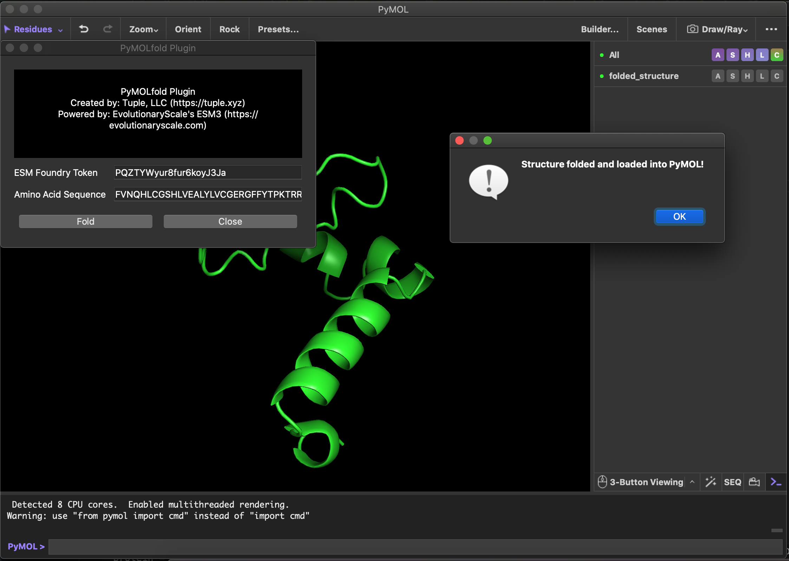

# PyMOLfold
Plugin for folding sequences directly in PyMOL using EvolutionaryScale's ESM3 model.

<h3 align="right">Colby T. Ford, Ph.D. | Tuple, LLC</h3>

## Installation

1. Download the [pymolfold.zip](pymolfold.zip) file from this repository.
2. Open PyMOL and in the menu bar, go to `Plugin` > `Plugin Manager`.
3. On the `Install New Plugin` tab, click the `Choose file...` button under "Install from local file".
4. Locate the .zip file and open it.
5. From the PyMOL console, install the ESM Python library: `pip install esm`

> [!NOTE]
> Note: To use this plugin, you'll need an API key from [Evolutionary Scale Forge](https://forge.evolutionaryscale.ai/). Otherwise, the plugin can't download the folding model.

Once installed, navigate to `Plugin` > `PyMOLfold` in the menu bar.
Then, in the dialog box, simply paste in your API key and amino acid sequence you wish to fold.

## Feature Roadmap

- [X] Basic folding with `esm3-small-2024-08`
- [ ] UI controls for temperature and steps.
- [ ] Support for multiple chains (or FASTA input format).
- [ ] UI Dropdown to select different models.
