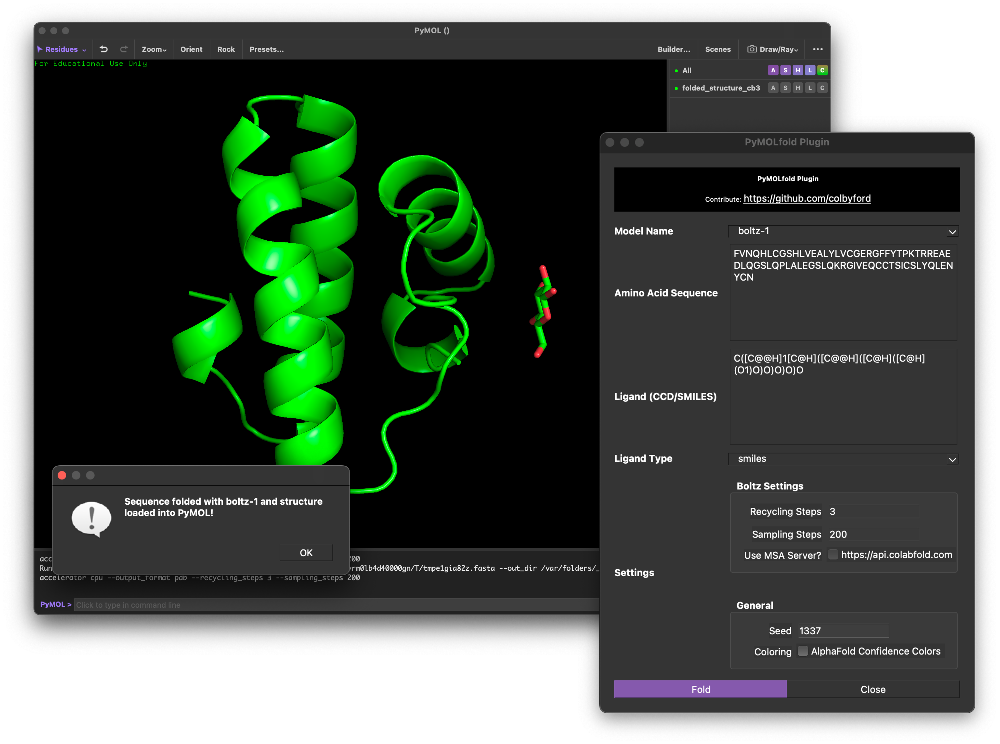
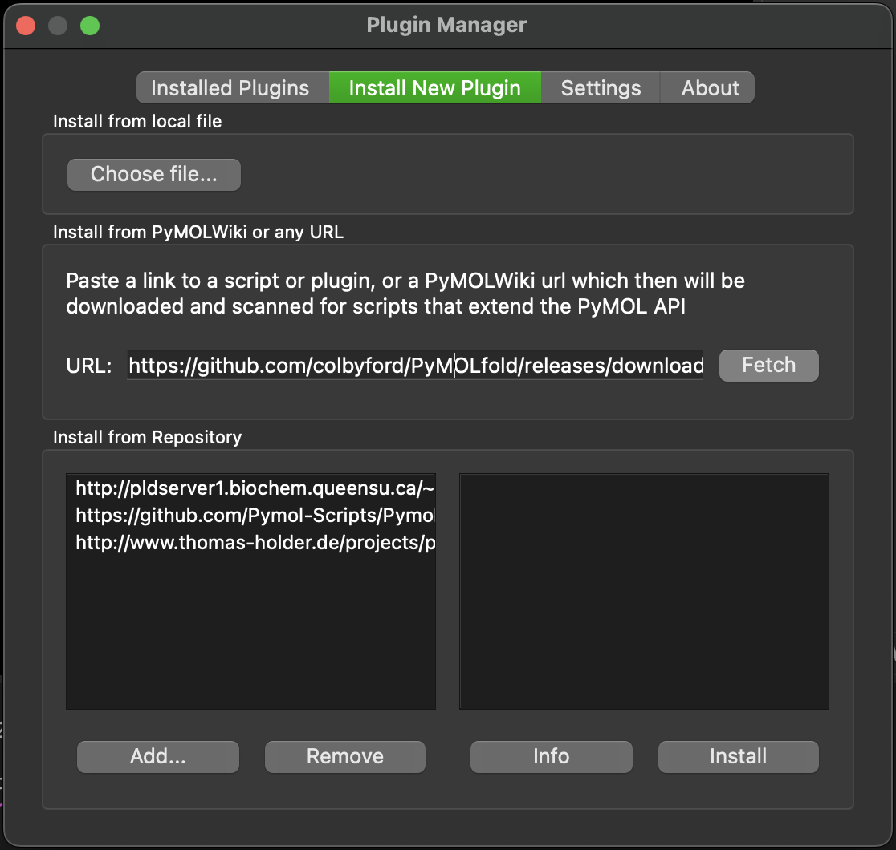

# PyMOLfold
Plugin for folding sequences directly in PyMOL using various models (ESM3, Boltz-1, Chai-1, and Protenix).

<h3 align="right">Colby T. Ford, Ph.D.</h3>



## Plugin Installation

### From Local Download
1. Download the *pymolfold.zip* file from this repository.
    - Latest release: https://github.com/colbyford/PyMOLfold/releases/latest
2. Open PyMOL and in the menu bar, go to *Plugin* > *Plugin Manager*.
3. On the *Install New Plugin* tab, click the *Choose file...* button under "Install from local file".
4. Locate the .zip file and open it.

### From the Web

1. Open PyMOL and in the menu bar, go to *Plugin* > *Plugin Manager*.

2. On the *Install New Plugin* tab, under the *Install from PyMOLWiki or any URL* section,  paste in the URL of the release .zip file from GitHub.
    - `https://github.com/colbyford/PyMOLfold/releases/download/<version>/pymolfold_<version>.zip`


3. Click the *Fetch* button and follow the prompts to install the package.


Once installed, navigate to *Plugin* > *PyMOLfold* in the menu bar.
Then, in the dialog box, simply paste in your API key and amino acid sequence you wish to fold.

> [!NOTE]
> Note: This plugin does not include any of the model package(s) or weights. You'll need to install them into the PyMOL Conda environment.


## Package Installation

You can install PyPI libraries from the PyMOL command line. You can also run the `pip` install commands from your normal terminal if you know the path to PyMOL's Python executable. Running from the terminal is a bit easier to troubleshoot any installation issues. To find the PyMOL Python executable, use the `sys` library as follows. 
Simply copy and paste these commands in the pymol command line interface terminal:

```python
import sys
print(sys.executable)
```
The output should be something like `/home/<username>/biotools/pymol/bin/python` on Linux or `/Applications/PyMOL.app/Contents/bin/python` on macOS.
Then, to run a command in your normal terminal, simply point to the PyMOL Python executable. For example:

```bash
/home/<username>/biotools/pymol/bin/python -m pip install <package_name>
```

Here are the example install commands for the supported models:

- ESM3: `pip install esm`
- Boltz-1: `pip install boltz`
- Chai-1: `pip install chai_lab==0.5.0`
- Protenix: `pip install --extra-index-url=https://pypi.nvidia.com --trusted-host pypi.nvidia.com nvidia-cublas-cu12 deepspeed==0.14.4 protenix`

> [!NOTE]
> Note: To use an ESM3 model, you'll need an API key from [Evolutionary Scale Forge](https://forge.evolutionaryscale.ai/). Otherwise, the plugin can't download the folding model.

## Using Conda
The version of PyMOL that can be downloaded from the [Schrödinger website](https://pymol.org/) is currently compiled with Python 3.10. On some operating systems, you may have some difficulties installing the various model packages with this Python version.

To get around this, we can use [conda](https://docs.conda.io/projects/conda/en/latest/user-guide/install/index.html) to get PyMOL with a different version of Python that will *hopefully* work with your desired folding library. You can modify the provided [envs/environment.yml](envs/environment.yml) file to install the desired Python version + model package. (Note: You likely cannot install all of the model libraries at the same time as they have dependency conflicts.) We have also provided some example eviroment files for the different models in the `envs/` directory.

```bash
## Change the `environment.yml` file to the corresponding YAML file of the model you want to use.
conda env create --file envs/environment.yml
## Go get a ☕️ as this will take a while.

conda activate pymolfold
pymol ## This will open the GUI

# conda deactivate
# conda env update --file environment.yml
# conda remove -n pymolfold --all
```

> [!NOTE]
> Note: Some macOS users may need to use the `pymol-open-source` package. If you prefer/need to use the open-source version of PyMOL and wish to install through conda, modify the `envs/opensource_environment.yml` environment file. 

## Feature Roadmap

- [ ] Support for multiple protein chains (with `esm3-medium-multimer-2024-09`).
- [X] Functionality for downloading existing structures from AlphaFoldDB and ModelArchive
    - In v0.4.0 release (Credit: @colbyford and @ullahsamee)
- [X] UI updates for model-specific controls
    - In v0.3.0 release (Credit: @colbyford)
- [X] Model support for Protenix model
    - In v0.3.0 release (Credit: @colbyford and @heidongxianhua)
- [X] Model support for Chai-1 (proteins and protein-ligand complexes)
    - In v0.2.5 release (Credit: @ullahsamee)
- [X] UI controls for temperature, steps, etc.
    - In v0.2.0 release (Credit @colbyford)
- [X] Model support for Boltz-1 (+ ligands)
    - In v0.2.0 release (Credit: @ullahsamee)
- [X] UI to select different models.
    - In v0.1.0 release (Credit: @colbyford)
- [X] Support for the latest ESM3 models.
    - In v0.1.0 release. (Credit: @colbyford)
- [X] Basic folding with `esm3-small-2024-08`.
    - In initial release. (Credit: @colbyford)


## Contributing
This PyMOL plugin is an open-source project by design. So, please fork this repository, make any changes, and submit a pull request. Also, log any feature requests or issues in the [Issues](https://github.com/colbyford/PyMOLfold/issues) section of this repo.

We try to follow the [PyMOL Plugins standard](https://pymolwiki.org/index.php/Plugins_Tutorial) for the UI and functionality. (This is why we use a [PyQt](https://riverbankcomputing.com/software/pyqt/intro) UI and keep all functions in one `__init__.py` file for now.)
